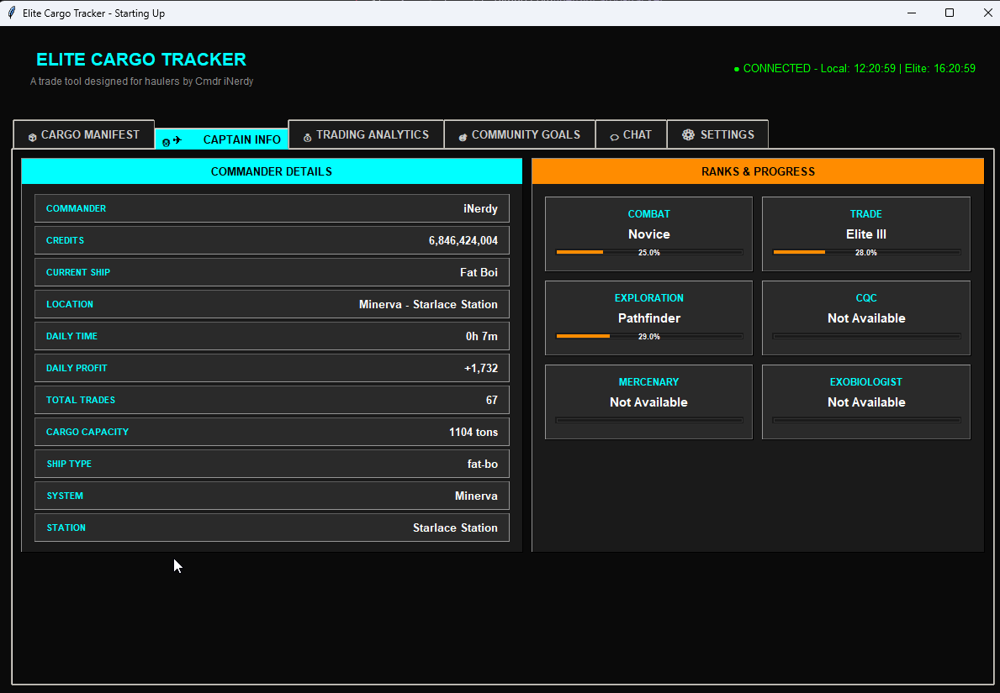

# Elite Cargo Tracker v1.0.9

A comprehensive cargo tracking and trading analytics tool for Elite Dangerous commanders. Monitor your cargo operations, track profits, and stay informed with real-time notifications.

## Description

Elite Cargo Tracker is a standalone Windows application that automatically monitors your Elite Dangerous journal files to provide real-time cargo tracking and trading analytics. Whether you're running trade routes, participating in community goals, or managing your fleet operations, this tool helps you stay organized and maximize your profits.

### Key Capabilities:
- **Real-time Monitoring**: Automatically reads Elite Dangerous journal files to track cargo changes
- **Trading Analytics**: Calculate profits, track trade routes, and analyze market performance
- **Community Goals**: Monitor and track progress on community goals and events
- **Discord Integration**: Send notifications to Discord channels for important events
- **Alert System**: Get notified of interdictions and other critical events
- **Data Export**: Export your trading data in CSV, JSON, or HTML formats

## Screenshots

### Chat


### Settings


### Community Goals


### Trading Analytics


### Captain Info


### Cargo Manifest


## Installation

This is a standalone executable - no Python installation required!

## Running the Application

### Windows
Double-click `Elite_Cargo_Tracker.exe` or run:
```cmd
Elite_Cargo_Tracker.exe
```

### Alternative
Double-click `run_cargo_tracker.bat` for a console window.

## Features

- Real-time cargo tracking from Elite Dangerous journal files
- Trading analytics and profit tracking
- Community goals integration
- Discord webhook notifications
- Red alert system for interdictions
- Export functionality (CSV, JSON, HTML)

## Configuration

The application will create `cargo_tracker_settings.json` on first run.
You can configure Discord webhooks, budget goals, and other settings through the UI.

## Version Information

- Version: 1.0.9
- Build Date: 2025-08-01
- Build Number: 010

## System Requirements

- Windows 7/8/10/11
- No Python installation required
- Internet connection for Discord webhooks and community goals

## Support

For issues or questions, please check the main repository.

## License

This project is licensed under the MIT License - see the [LICENSE](LICENSE) file for details.
